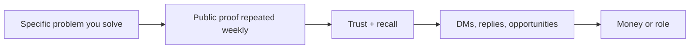
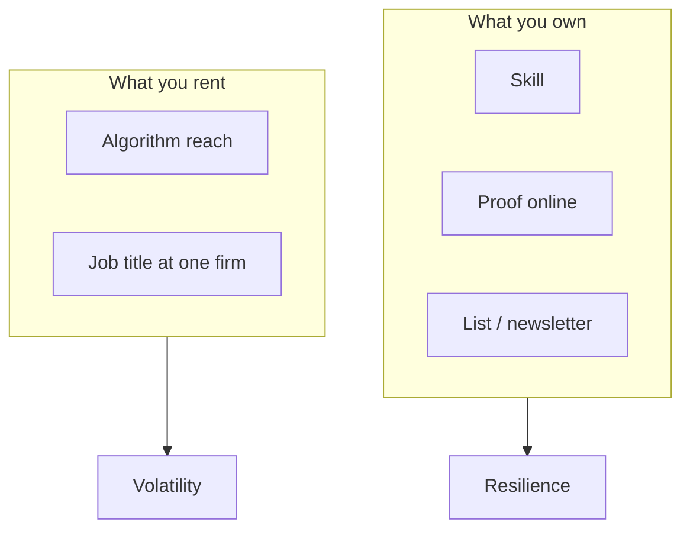
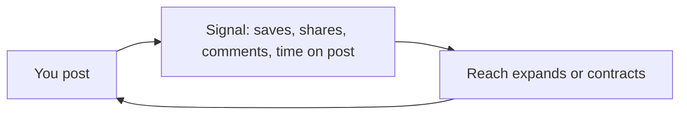
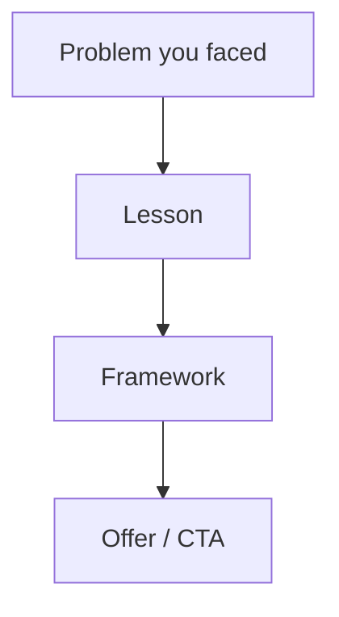
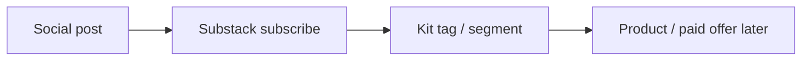
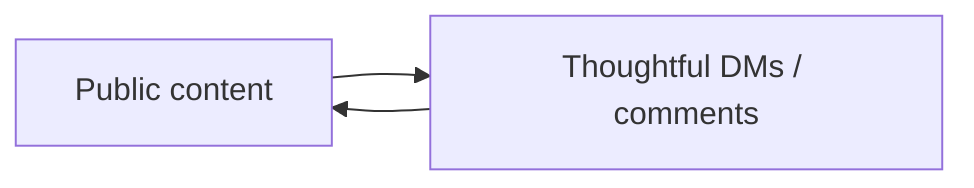
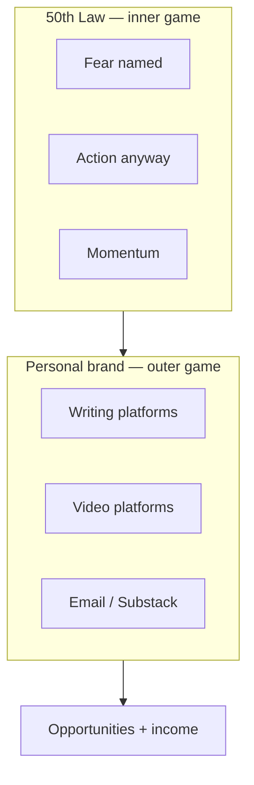

# April 2026 — 8 Substack Newsletters (2×/week)

**Source:** *The 50th Law* — 50 Cent & Robert Greene  
**Structure:** Each issue = **(A)** book lens + calm / harsh truth + quotes **(B)** growing your personal brand + platforms + numbers + diagram  
**Suggested send days:** Wed + Sat (adjust to your list)

---

## Send calendar (April 2026)

| # | Suggested date | Theme |
|---|----------------|--------|
| 1 | Wed Apr 1 | Fear vs. visibility — why hiding costs you |
| 2 | Sat Apr 4 | Self-reliance — your “CV” is what’s public |
| 3 | Wed Apr 8 | Momentum — algorithms reward motion |
| 4 | Sat Apr 11 | Reading the room — platform culture |
| 5 | Wed Apr 15 | Turning absence into presence — content systems |
| 6 | Sat Apr 18 | The long game — newsletter + email as asset |
| 7 | Wed Apr 22 | Relationships & leverage — DMs, comments, deals |
| 8 | Sat Apr 25 | Integration — fearlessness + brand as one system |

---

## Newsletter 1 — “The 50th Law in one sentence: stop negotiating with fear”

### Subject line options
- Fear is expensive. Visibility is compound interest.
- What 50 Cent and Greene would say about your blank profile

### Part A — *The 50th Law* (calm + harsh truth)

Greene and 50 Cent built *The 50th Law* around a brutal premise: **most people don’t fail from lack of talent. They fail from fear dressed up as “prudence.”** Fear makes you wait for perfect conditions. Fear makes you optimize for safety instead of reality. Fear makes you invisible—and invisibility is a strategy only if you’re already safe forever.

**Harsh truth:** If you’re building a career or a business in public markets (clients, employers, algorithms), **anonymity is not neutral.** It reads as “no proof.”

**Calm truth:** Fearlessness isn’t recklessness. It’s the practice of acting *despite* fear until fear loses its veto power.

**Quote lane (book / Greene universe):**
- *“Your fears are a kind of prison that confines you…”* — Greene (paraphrased from the fear-as-constraint thread in the book’s framing)
- *“The greatest fear people have is that of being themselves.”* — often cited alongside Greene’s work on authenticity vs. performance

**Micro-lesson from the book’s spirit:** Treat fear like a bad advisor. Listen once, note it, **move anyway** at small stakes. Small public actions beat large private plans.

### Part B — Personal brand: why it’s the new CV

**Thesis:** A résumé is a *claim*. A personal brand is *evidence*—writing, video, frameworks, opinions, consistency. Your future client or hiring manager is guessing risk. **Proof reduces risk.**

**Simple equation**

**Numbers to anchor the argument (use as “model math,” not promises):**
- **100 pieces of public work** often teach you more than **1** “perfect” piece never published.
- If **1%** of a small audience engages, **10,000** reachable people ≈ **100** signals per post (illustrative).
- **7-touch** rule (marketing folklore): people need multiple exposures before they act—your feed is those touches.

**Writing-heavy platforms (pick 1–2 to own first):** X, LinkedIn, Substack, Threads.

**Video / image-heavy:** Instagram Reels, TikTok, YouTube.

**Top 5–style names (snapshot — swap for your niche):**

| Platform | Names (illustrative “top of feed” energy) |
|----------|-------------------------------------------|
| **X** | Naval Ravikant, Dickie Bush, Sahil Bloom, Justin Welsh, Dan Koe |
| **LinkedIn** | Lara Acosta, Justin Welsh, Richard van der Blom, Matt Gray, relevant operators in your industry |
| **Substack** | Lenny Rachitsky, Packy McCormick, Ethan Mollick, Anne-Laure Le Cunff, a sharp niche writer you actually read |
| **Threads** | Cross-posters + visual storytellers; often same creators winning on IG—follow who your audience follows |
| **Instagram** | Educators + lifestyle operators with tight hooks (pick 5 in your vertical) |
| **TikTok** | Fast-hook educators + contrarians (pick 5 you’d happily emulate) |
| **YouTube** | Long-form explainers + documentary-style builders (pick 5) |

### My journey (this issue)

I didn’t wake up thinking “personal brand.” **Until 2024** I treated X (Twitter) like a slot machine: random posts, hope for lightning. **Months** went by—**~5 likes**, **maybe 1 comment**, **no DMs** for the first **3 months** because I had nothing to say. **Comments?** Basically none. After **3 months** my “engagement” was **“yes,” “indeed.”** I was visible without being *useful*.

**Takeaway for you:** The 50th Law isn’t about being loud. It’s about **refusing to let fear keep you in the comment section of your own life.**

---

## Newsletter 2 — “Self-reliance: nobody is coming to validate you into money”

### Subject line options
- Your CV didn’t fail. Your distribution did.
- Self-reliance looks boring from the outside

### Part A — *The 50th Law*

A core Greene theme through the 50 Cent lens: **dependency is fragility.** If your self-worth waits on a gatekeeper, you’ve outsourced your nervous system to someone busy.

**Calm truth:** Build systems you control—skills, content, audience, offer.

**Harsh truth:** If you won’t publish proof, you’re asking the world to **trust intent instead of evidence.** That’s a harder sale.

**Quote lane:**
- *“When you work for others, you are at their mercy.”* — Greene (from his broader corpus; fits the self-reliance chapter energy of *The 50th Law*)

### Part B — Personal brand as self-reliance

**“Personal brand = new CV” expanded:**  
CV says “I can.” Brand shows **how you think**—clients buy thinking style + judgment.

**Numbers:**
- **1** clear problem statement in your bio beats **10** vague adjectives.
- **3** pillars of content > **30** random topics.

**Platform note:** **LinkedIn** rewards *professional narrative*; **X** rewards *sharp clarity*; **Substack** rewards *depth*; **Threads** rewards *human shorthand*. Same you—different packaging.

### My journey (this issue)

After **~6 months** on X I started **talking to people** and **studying bigger accounts**. Names I didn’t know at first: **Dan Koe, Alex Hormozi, Dakota Robertson, Justin Welsh, Matt Gray, Lara Acosta.** I wasn’t “networking.” I was **reverse-engineering tone + structure.**

Still: **~3 months** with weak X results pushed me to **Upwork**—**$3/hr** energy, brand-new profile. I earned **$15** on a silly first task (a random testimonial). I felt like I’d won the lottery. **But none of that came from social proof yet.**

**Lesson:** Money without distribution teaches you execution; **money with distribution teaches you leverage.**

---

## Newsletter 3 — “Momentum beats motivation (the algorithm is a mirror)”

### Subject line options
- You don’t need hype. You need reps.
- The 50th Law for people who post once and vanish

### Part A — *The 50th Law*

50’s story is a case study in **momentum under pressure**: keep moving, convert friction into fuel. Greene’s through-line: **inaction has a cost**—usually paid as regret, obscurity, or slow wage growth.

**Harsh truth:** Consistency isn’t glamorous. Neither is the gym. Both change the body.

**Calm truth:** Momentum is **a schedule**, not a mood.

### Part B — Algorithms 101 for adults

Algorithms aren’t magic; they’re **pattern detectors.** They approximate: *Will people stay? Will they reply? Will they share?*

**Numbers:**
- **3–5** posts/week beats **1** “masterpiece” / month for learning speed (early phase).
- Track **one** metric weekly: profile visits, saves, or list signups—not all at once.

**Top 5 reminder:** Don’t copy celebrities; copy **operators** one step ahead of you (same table as issue 1—refresh quarterly).

### My journey (this issue)

First wins were tiny: **$20, then $50, then $100, then $300, then $500**—after **~6 months** of learning and applying, not from one viral thread. Social was still catching up to my skills.

**In 2025** I took **Dan Koe’s 2-Hour Writer** course. I didn’t even know what a **newsletter** was or how an **algorithm** actually worked. Templates felt like cheating until I realized: **they’re training wheels, not the bike.**

I built a newsletter on **Beehiiv**, later moved to **Substack**; **Kit** for future product email. The stack matters less than **the habit of shipping.**

---

## Newsletter 4 — “Read the room: platform culture is not ‘optional etiquette’”

### Subject line options
- LinkedIn is not X with a suit. X is not Substack with speed limits.
- Street smarts online = context control

### Part A — *The 50th Law*

A street-smart idea in the book’s spirit: **power observes context.** The same confidence that plays on a stage can bomb in a boardroom. Greene’s histories are full of people who misread the room and paid for it.

**Harsh truth:** “Authenticity” without **context** reads as self-absorption.

**Calm truth:** Learn the dialect of each platform; keep the same spine.

### Part B — Where to write vs. where to perform

| Mode | Best platforms | What to ship |
|------|----------------|--------------|
| Writing / ideas | X, LinkedIn, Substack, Threads | threads, carousels-as-text, essays, short loops |
| Video / image | Instagram Reels, TikTok, YouTube | hooks, demos, talking head, B-roll stories |

**Numbers:**
- **15–30s** hook decides Reels/TikTok retention.
- **First line** of a LinkedIn post decides the read.
- **Newsletter:** **1** idea, **3** bullets, **1** action.

### My journey (this issue)

On **X** I learned **pace + punchlines**. On **LinkedIn** I learned **story + lesson + whitespace**. Same brain; different costume. My early mistake was **posting “X energy” on LinkedIn** without adapting—people scroll with different intent.

---

## Newsletter 5 — “Turn wounds into work (content as processing power)”

### Subject line options
- Your disadvantages are data—if you publish the lessons
- The 50th Law: convert pressure into product

### Part A — *The 50th Law*

50’s biography is basically **alchemy**: take chaos, distill story, sell reality. Greene frames fearlessness as **using reality as it is**, not as you wish it were.

**Quote lane (often associated with the book’s ethos):**
- *“The path to success is to take massive, determined action.”* — commonly paired with 50 Cent / hustle literature (use if it fits your voice)

**Harsh truth:** Complaining without publishing lessons wastes the pain.

**Calm truth:** One honest lesson post builds more trust than ten “humble brags.”

### Part B — Brand = documented growth

**Numbers:**
- **1** case study/month > **10** opinion threads with no proof.
- Save **10** screenshots of wins, DMs (with permission), metrics—**evidence bank**.

### My journey (this issue)

**$15** on Upwork felt huge because it proved **someone would pay**. The mistake would’ve been stopping there. The next chapter was **learning distribution** so I wasn’t forever renting time at **$3/hr** psychology.

---

## Newsletter 6 — “The newsletter is not ‘content.’ It’s an asset.”

### Subject line options
- Substack is a bank account for attention
- Why email still beats “maybe the algorithm will be nice today”

### Part A — *The 50th Law*

Self-reliance again, modernized: **rented reach** (platforms) should **feed owned reach** (email). Greene’s historical figures survive plot twists by owning networks—messengers, allies, printing presses. Your printing press is **your list**.

**Harsh truth:** If you only build on rented land, you’re a tenant.

**Calm truth:** A small list that trusts you beats a big following that forgets you.

### Part B — Substack + Kit split (your model)

- **Substack:** depth, essays, community surface, discovery.
- **Kit (ConvertKit):** launches, segments, product ladder, automation.

**Numbers:**
- **20%** open rate on a warm list is a common baseline to aim at (varies wildly—track yours).
- **500** engaged readers often beat **50,000** strangers for revenue.

**Top 5 on Substack** (illustrative): pick writers your readers already pay attention to; study **subject lines + cadence**, not vibes.

### My journey (this issue)

I didn’t know newsletters existed as a **serious lever** until structured learning. Moving **Beehiiv → Substack** was me choosing **simplicity + reader habit**. Kit is my **business spine** for what comes next—not instead of Substack, **beside** it.

---

## Newsletter 7 — “Relationships scale (if you stop ghosting your own outreach)”

### Subject line options
- Your first DM doesn’t need to be perfect. It needs to exist.
- Fearlessness is a DM with respect

### Part A — *The 50th Law*

Fear makes you silent. Silence makes you forgettable. The book’s practical energy: **initiate.** Initiation creates luck because luck needs a door to walk through.

**Harsh truth:** If you won’t message, you don’t get to complain about “no network.”

**Calm truth:** Good outreach is **specific gratitude + one question**—not a novel.

### Part B — Social brand = public + private loop

**Numbers:**
- **5** real conversations/week beats **500** passive likes.
- **10** custom comments/day on peers’ posts for **30 days** changes your graph.

**Platform tip:** **LinkedIn** comments are undervalued real estate. **X** replies build thread visibility. **Threads**—fast banter. **Substack**—notes and guest posts.

### My journey (this issue)

**First 3 months: zero DMs.** Then **“yes / indeed.”** Then I learned **to start conversations** and study operators. The inflection wasn’t a hack; it was **courage + curiosity at small stakes.**

---

## Newsletter 8 — “April close: fearlessness × personal brand = one system”

### Subject line options
- Stop separating “mindset” from “marketing”
- The 50th Law, translated for creators

### Part A — *The 50th Law* (synthesis)

**One paragraph synthesis:** The book argues that **fear is the tax you pay for a life designed by others.** Fearlessness is the decision to **own outcomes**—to read reality, move with momentum, build self-reliance, initiate relationships, and convert adversity into advantage. It’s not cruelty; it’s **clarity**.

**Quote send-off (Greene family of ideas):**
- *“The time that leads to mastery is dependent on the intensity of our focus.”* — Robert Greene (*Mastery*) — use if you want a clean close on craft.

### Part B — The full stack (your April thesis)

**Personal brand is the new CV** because hiring and buying are **risk management.** Proof beats promises.

**Numbers (your public case study — as of 2026 story you shared):**
- **~4.2k** followers on **X**
- **~15.1k** followers on **LinkedIn**
- **860+** subscribers on **Substack**

**Closing line you can use verbatim:**  
“I’m not sharing everything—**the full case study lives in the work.** But the direction is simple: **fear kept me invisible; systems made me legible.**”

---

## Reusable footer block (optional)

**P.S.** If this resonated, hit reply with your platform of choice (X, LinkedIn, Substack, Threads, Reels, TikTok, YouTube) and your **one** bottleneck—I read every response.

---

## Appendix — “Top 5” style accounts by platform (illustrative snapshot)

Use as **starting research**, not eternal truth. Swap names for **your sub-niche** (e.g., dev, health, finance).

**Writing / threads / essays**

- **X (Twitter):** Naval Ravikant · Dickie Bush · Sahil Bloom · Justin Welsh · Dan Koe  
- **LinkedIn:** Lara Acosta · Justin Welsh · Matt Gray · Richard van der Blom · Alice Lemée (swap last for a star in *your* industry)  
- **Substack:** Lenny Rachitsky · Packy McCormick · Ethan Mollick · Anne-Laure Le Cunff · Foster collective writers you admire (pick one named star)  
- **Threads:** Creators who native-post (not only repost IG): pick **5** where your audience already spends time—often overlaps with IG/TikTok stars; refresh quarterly  

**Video / image**

- **Instagram (Reels):** Gary Vaynerchuk · Alex Hormozi (clips) · Leila Hormozi · Steven Bartlett (clips) · pick one **operator** in your niche  
- **TikTok:** Alex Hormozi · Iman Gadzhi · Leila Hormozi · Steven Bartlett · one **micro-niche** educator with hooks you can study  
- **YouTube (long + Shorts):** Ali Abdaal · Iman Gadzhi · Dan Koe · Alex Hormozi · Matt D’Avella (storytelling / craft model)  

---

## Notes for you (editorial)

1. **“Top 5” lists** are inherently subjective; refresh monthly and **prefer people your audience already respects** in your niche (dev, fitness, finance, etc.).
2. **Quotes:** For print-safe attribution, verify exact wording in your copy of *The 50th Law* / Greene’s books before hitting send.
3. **Cadence:** 2×/week in April = **8 sends**; you can merge/adjust if burnout risk—**depth beats collapse.**

---

*File generated for your Substack workflow — April 2026.*
