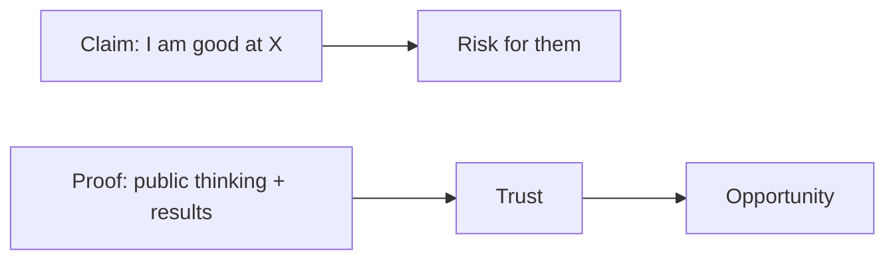
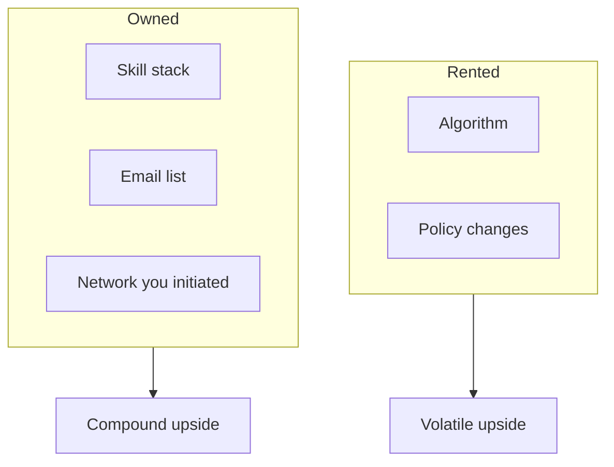
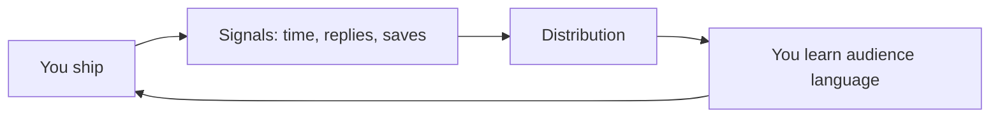
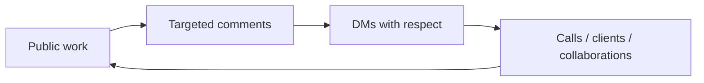

# Four Substack articles — *The 50th Law* × personal brand

**Source:** *The 50th Law* — 50 Cent & Robert Greene  
**Voice:** Calm observation + blunt truth; self-help without fluff  
**Your thread:** 2024 → X, slow growth, Upwork, course, Beehiiv → Substack + Kit, 2026 numbers  

Use each piece as a **standalone essay** or a **four-part arc** (publish in order or spaced however you like).

---

## Article 1 — *The real tax isn’t failure. It’s fear dressed as “being smart.”*

### Subtitle options
- What *The 50th Law* looks like if you’re building in public in 2026  
- Why your blank profile is a decision, not an accident  

### The book, without the theater

Robert Greene and 50 Cent didn’t write *The 50th Law* so you could feel tough for a weekend. The spine of the book is simpler and harsher than that: **most people don’t lose because the world is unfair. They lose because fear negotiates their moves before they ever touch the board.**

Fear doesn’t always show up shaking. Sometimes it shows up as **perfectionism**, **“I’ll start when…”**, **“my niche isn’t clear yet,”** or the quiet comfort of **never being wrong in public**—because you never say anything specific enough to be wrong.

Greene’s historical examples and 50’s biography keep returning to the same idea: **reality rewards motion that respects reality.** Not fantasy motion. Not rage-posting. Not hustle clichés. *Motion.*

**Calm truth:** You don’t need to be fearless. You need to **act with fear present**—like carrying a noisy passenger who doesn’t get to steer.

**Harsh truth:** If you’re waiting to feel ready before you’re visible, you’ve chosen **invisibility as a strategy.** That can work if you already have a fortress. If you’re trying to earn clients, jobs, or leverage in open markets, invisibility reads as **“no evidence.”**

A line Greene fans repeat (it captures the book’s pressure on self-deception): **the worst cage is the one you agree to live in because it feels safe.**

### Personal brand isn’t vanity. It’s evidence.

People call it “personal brand” like it’s a costume. In practice, for anyone who sells skill or judgment, it’s closer to this:

**A résumé is a claim.**  
**A personal brand is proof repeated over time.**

Your future client or hiring manager is doing risk management. Proof reduces perceived risk faster than adjectives.

**Numbers that keep me honest (not promises—frames):**
- **1** specific problem in your bio beats **10** vague labels (“multipotentialite,” “thinker,” “builder”).
- **100** imperfect public reps often teach you more than **1** masterpiece you never ship.
- Marketing folklore says people need **multiple touches** before they act; your content is those touches.

### Where writing lives vs. where video lives

If your edge is **language and thinking**, lean into **X, LinkedIn, Substack, Threads**.  
If your edge is **demonstration, energy, face, pace**, lean into **Instagram Reels, TikTok, YouTube**.

You don’t need all of them. You need **one writing home** and **one repetition habit** until the machine recognizes you.

### My start (so you don’t mythologize yours)

Until **2024**, I didn’t think in terms of personal brand. I joined **X (Twitter)** and posted like I was pulling a slot machine lever: random thoughts, hope for a jackpot.

For **months**: **~5 likes**, **maybe one comment**, **no DMs** in the first **three months** because I genuinely didn’t know what to say. Comments on other people’s posts? **Basically none.** After three months my “strategy” was typing **“yes,” “indeed.”** I was technically present and practically invisible.

That’s not a morality story. It’s a **mechanics** story: **fear + no system = noise.**

*The 50th Law* isn’t telling you to be loud. It’s telling you to **stop letting fear be the editor of your life.**

### Close

Pick **one** small public act this week that your fear would veto: a post with a clear point, a comment that adds a real sentence, a DM that’s respectful and specific. **The law isn’t “no fear.”** The law is **no surrender.**

---

## Article 2 — *Self-reliance in the age of algorithms (and why email still matters)*

### Subtitle options
- Rented reach feeds owned reach—or you stay fragile  
- What Greene would call “dependency,” translated for creators  

### The book: dependency is a leak

A Greene-consistent reading of *The 50th Law* (and the survival logic in 50’s story) is blunt: **if your entire future is parked inside someone else’s mood, policy, or quarterly earnings, you’re fragile.**

That’s true emotionally (validation addiction) and structurally (platform risk).

**Calm truth:** Platforms are incredible **discovery engines.**

**Harsh truth:** Discovery without **retention** is a hobby.

If you only exist where the algorithm can throttle you tomorrow, you’re not building a career—you’re **renting attention** and calling it equity.

Greene’s corpus returns to a harsh kindness: **build what you can control**—skills, alliances, assets. In 2026, for knowledge workers and creators, a modern version looks like:

- **Public proof** (posts, clips, writing)
- **Private trust** (conversations, reputation)
- **Owned line** (email/newsletter)

### “Personal brand is the new CV” — the adult version

A CV says: *trust my past titles.*  
A brand says: *watch how I think in real time.*

That’s why sharing your “CV” as a living body of work beats a PDF for many roles and offers: **judgment is visible.** People buy **how you reason**, not only **what you claim**.

**Simple equation (behavioral, not mystical):**

**Specific value × visible proof × consistent cadence → trust → conversations → money**

### My detour through marketplaces (and what it taught me)

After months on X with weak results, I opened **Upwork**. New account energy: **~$3/hour** positioning. I earned **$15** on a small first task—basically writing a random testimonial.

I felt rich. **$15 online** will do that when it’s your first proof that a stranger will pay.

But that money wasn’t coming from **distribution** I controlled. It was coming from **a marketplace’s gravity**—useful, but narrow.

Later, with more skill and practice, I saw **$20, then $50, then $100, then $300, then $500**—still a ladder, still human-scale, still real. The lesson I care about isn’t the amounts. It’s this:

**Execution without distribution teaches you craft.**  
**Craft + distribution teaches you leverage.**

### The stack I use now (so you can steal the logic, not the tools)

In **2025** I took **Dan Koe’s 2-Hour Writer** course. I didn’t even fully understand what a **newsletter** was, or how an **algorithm** actually behaved. Templates felt like cheating until I realized they were **training wheels** for thinking faster in public.

I started a newsletter on **Beehiiv**. Now I’m on **Substack** for publishing. **Kit** is my lane for **email marketing** around future digital products—segmentation, launches, the boring machinery that turns attention into a business.

Tools change. The principle doesn’t: **capture trust in a place you can reopen the conversation.**

### Close

If you post only on rented land, you’re not wrong—you’re **unfinished.** Add **one owned habit**: a subscribe link, a welcome email, a monthly essay. Self-reliance sounds dramatic until you realize it’s mostly **boring systems**.

---

## Article 3 — *Momentum beats motivation—and the algorithm is a mirror*

### Subtitle options
- What *The 50th Law* shares with boring consistency  
- Why “one banger a month” is usually a trap early on  

### The book: keep moving under pressure

50 Cent’s biography, as Greene frames it, isn’t a celebration of chaos. It’s a study of **momentum under constraint**: when the world is noisy, when resources are thin, when the safest-looking move is retreat—**advance in small, real steps anyway.**

That’s the emotional engine behind *The 50th Law*: **inaction has a cost**, paid as obscurity, stagnation, or slow wage growth.

**Harsh truth:** Your feelings about posting are not stakeholders.

**Calm truth:** Motivation is weather. **Cadence is architecture.**

### Algorithms, without mysticism

Platforms approximate a crude question: **will people stay, reply, save, share?**

So the algorithm isn’t your enemy or your god. It’s a **mirror** skewed by incentives.

**Numbers I use as training dials (not guarantees):**
- Early phase: **3–5** publishing reps per week often beats **1** monthly “masterpiece” for learning speed.
- Track **one** metric for a month: profile visits, saves, or subscribers—**not all at once.**

### Platform culture is real (street smarts, online)

A *50th Law*-flavored skill is **reading the room**. The same idea can land on X and flop on LinkedIn if you ignore **context**. Not because people are fake—because **intent differs**.

- **X:** compression, sharpness, fast iteration  
- **LinkedIn:** narrative + lesson + professional stakes  
- **Substack:** depth, continuity, relationship  
- **Threads:** informal loops, fast tone  

Video platforms reward **hooks** and **pattern interrupts**; writing platforms reward **clarity** and **novelty of framing**.

### People worth studying (swap for your niche)

**Writing-heavy:** strong operators on **X** and **LinkedIn** (e.g., voices like **Justin Welsh**, **Lara Acosta**, **Dan Koe**—I studied these after I finally decided to learn instead of lurk).  
**Video-heavy:** study **YouTube** and **Shorts/Reels** craft (hooks, retention curves), not celebrity fame.

### My learning curve (no fairy tale)

I spent a long season posting into fog. The inflection wasn’t a secret hack. It was **education + reps**—especially after a writing course forced me to understand **templates, angles, packaging**.

If you’re embarrassed by your early posts, good: **you’re not supposed to peak at the beginning.**

### Close

*The 50th Law* isn’t asking you to be reckless. It’s asking you to **stop confusing stillness with wisdom.** Ship small, learn the room, tighten weekly. **Momentum is a schedule.**

---

## Article 4 — *Initiation beats waiting (DMs, comments, and the end of “indeed”)*

### Subtitle options
- Fear makes you silent; silence makes you forgettable  
- The personal brand stack: public proof + private conversation  

### The book: initiate

Fear’s favorite strategy is **delay**. Delay feels intelligent. Delay feels safe.

Greene’s histories—and the street logic in 50’s arc—keep showing the same counter-move: **initiate contact, initiate movement, initiate experiments** before you feel fully ready.

Not as spam. Not as desperation. As **agency**.

**Harsh truth:** If you won’t message, you don’t get to complain about “no network.”

**Calm truth:** Good outreach is short: **specific gratitude + one clean question** (or one useful observation).

### Personal brand is not only content. It’s conversation.

This is the part people skip because it’s socially exposed.

Public posts create **discovery**.  
Thoughtful comments and DMs create **relationship**.

**Numbers as discipline:**
- **5** real conversations a week beats **500** passive likes.
- **10** thoughtful comments a day for **30 days** changes your graph—because you stop being a ghost in other people’s rooms.

### The names that rewired how I saw the game

Around **six months** into taking X seriously, I started studying accounts I didn’t even know at first: **Dan Koe, Alex Hormozi, Dakota Robertson, Justin Welsh, Matt Gray, Lara Acosta.** Not worship—**deconstruction**: hooks, pacing, positioning, offer logic.

That’s the creator version of *The 50th Law*: **stop pretending you can think your way into mastery without models.**

### Where I am now (case study, not a flex)

I’m not sharing every private metric. The public spine matters more than the gossip:

- **~4.2k** followers on **X**  
- **~15.1k** followers on **LinkedIn**  
- **860+** subscribers on **Substack**  

If you’re earlier than this, you’re not behind—you’re in the part of the story where **fear is loudest**.

If you’re later than this, you already know: **the next level is systems, offers, and depth—not follower panic.**

### Close — synthesis

*The 50th Law* and personal branding aren’t two separate self-help hobbies. They’re the same instruction:

1. **Name the fear** (visibility, judgment, inexperience).  
2. **Act at small stakes anyway.**  
3. **Build proof** where your buyers actually look.  
4. **Own a line** to people who choose you (email).  
5. **Initiate** relationships like a serious person.

Personal brand is the new CV because **the world is trying to guess risk.** Give them **evidence**, not vibes.

---

## Optional publishing order

1. **Article 1** — fear / visibility / proof  
2. **Article 2** — self-reliance / owned attention / stack  
3. **Article 3** — momentum / algorithms / culture  
4. **Article 4** — initiation / DMs / synthesis + your numbers  

---

## Note on quotes

Before publishing, **verify exact wording** in your copy of *The 50th Law* for any line you want attributed with perfect precision. The essays above prioritize **the book’s thrust** and Greene’s recurring themes over citation theater.

---

*Draft ready to paste into Substack; add your byline, one personal image, and your subscribe CTA.*
